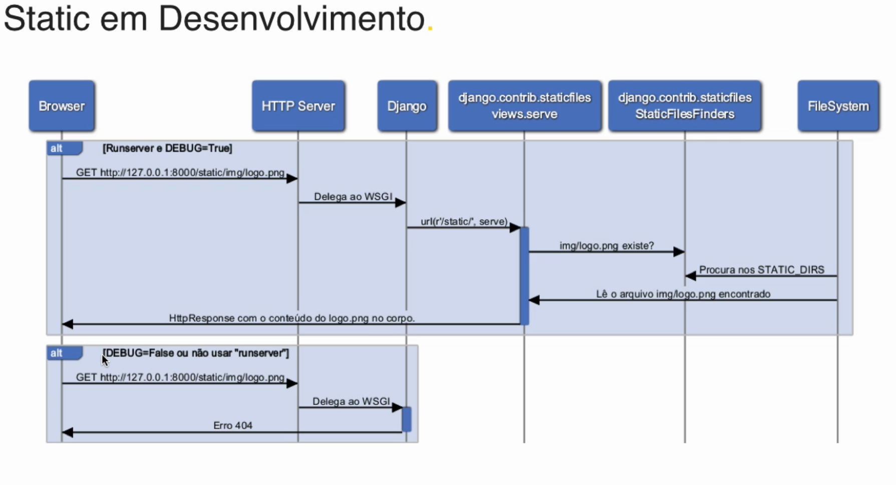
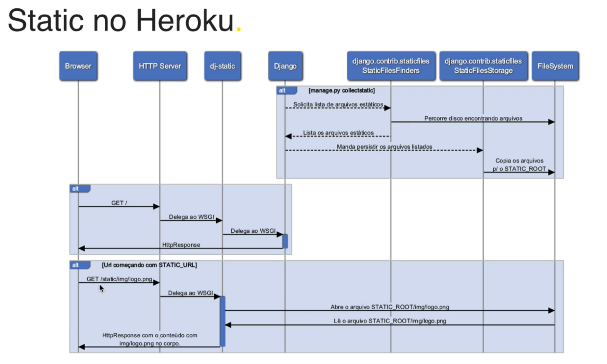
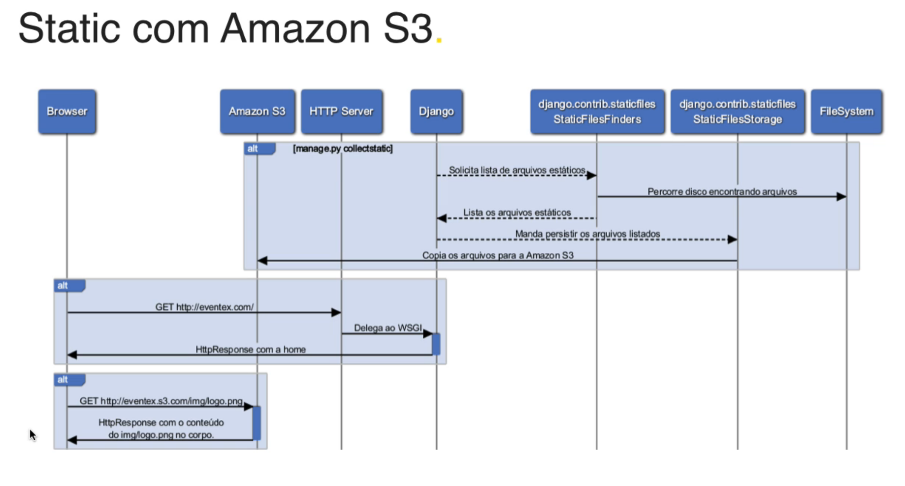
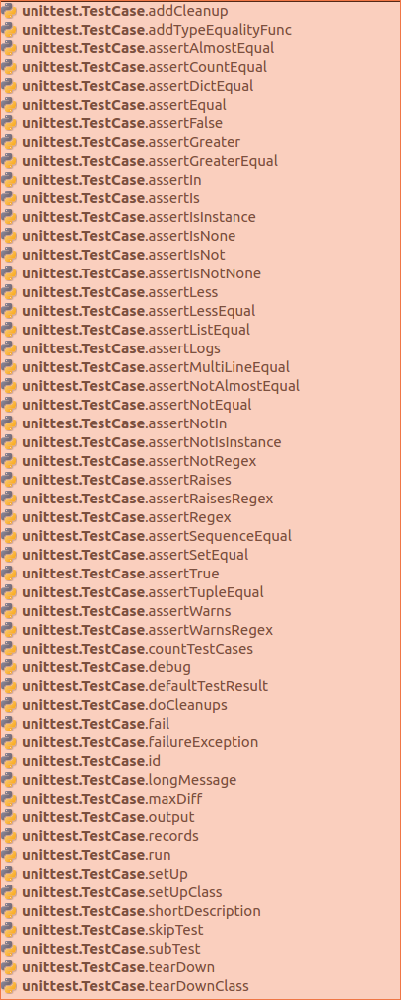
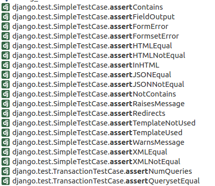
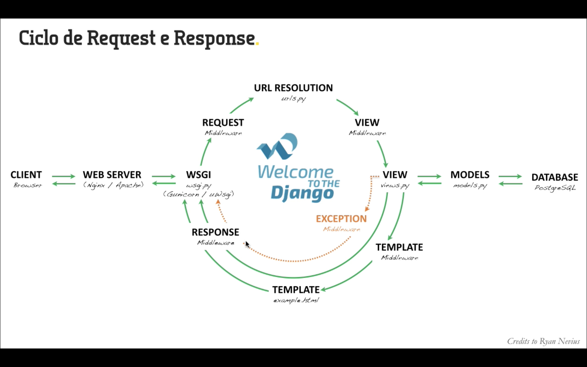

# Welcome To The Django

Repositório com tarefas e anotações extraídas do curso [Welcome to the Django](Welcometothedjango.com)  

```commandline
sudo apt-get install tree # para ver pastas e subpastas como arvore
```  

## M1A25  

Passos:  

1. Cria-se projeto Django (Eventex);  
1. Cria-se uma Django app (core);  
1. Adiciona app `core` ao settings (`eventex.core`);  
1. Configuramos uma rota para a raiz do site;  
1. Associamos a rota a uma view home dentro da app `core`;  
1. Criamos a index.html;    

### Organização  

```python
# Criando diretório para receber o projeto Django  

mkdir wttd  

# entrando na pasta  
cd wttd  

# criando ambiente virtual (venv)  
python3 -m venv .wttd  # cria diretorio oculto para separar arquivos e codigos do venv separados do projeto DjAngo

# para ativar venv:
source .wttd/bin/activate

# instalando django
pip install django
```
### Criando projeto Django  

```python
django-admin startproject eventex . #eventex e o nome do projeto; o ponto indica que projeto deve ser criado no diretorio raiz;  
# Caso ponto não seja indicato, uma pasta com o nome do projeto será criada apra armaneza-lo...
```  
  
O projeto criado é um pacote de python, uma vez que possui o dunder init (`__init___`)

O **manage.py** é o endpoint do Django. Vamos utilizá-lo para ativar todos os recursos do Django.  
  
Para poder acessar o manage.py a partir de outras pastas, podemos criar um *alias*:
```commandline
alias manage='python $VIRTUAL_ENV/../manage.py'
```
Esse *alias* pode ser adicionado ao `~/.bashhrc` ou `~/.profile`;  

#### Rodando o servidor do Django  

```commandline
manage runserver
```  

### Criando  uma Django app  

app é uma biblioteca python que segue conveções do Django.

```commandline
manage startapp core #core e o nome dado a app
```
Nossa app criada (*core*) deve estar dentro da pasta do projeto Django (*eventex*, neste caso), que estará dentro do diretório de trabalho (*wttd*, neste caso).  
Nota mental: Por isso, mais à frente vamos inserir em `settings.py` o `eventex.core` em `INSTALLED_APPS`  
  
* Manage.py está alinhado ao eventx (é irmão);
* Dentro do *core* estará o *models*, *tests* e *views*;  

### Adicionando app ao settings  

No `settings.py` que está na pasta do projeto (eventex, neste caso), vamos adicionar `eventex.core` na lista de `INSTALLED_APPS`  
 **Não deixar de colocar mais uma virgula após a string nova**;  
 
### Adicionando uma rota  

O `urls.py` é a raiz de todas as rotas da nossa aplicação....  
Há duas formas de trabalhar com rotas:
`pasths` ou `expressões regulares`;  
Em `urlpatterns` vamos adicionar `path('', eventex.core.views.home)` # string vazia indicando a raiz do site;
Além disso, precisaremos garantir que `urls.py` está carregando a nossa app *core*:
`import eventex.core.views`  

### Criando view:  

Em core, abrimos `views.py` e inserimos uma função que receberá o request, a processará e retornará  
> Toda view do Django é um objeto chamado (função, classe, instancia). Sempre recebe como primeiro prâmetro uma instancia de  HTTP REQUQEST, e sempre retorna uma instancia de HTTP RESPONSE.  

O DJango possui um **render** que irá processar o request com um template (index.html) retornando uma instancia do http response....  

```python
def home(reques):
    return render(request, 'index.html')
```  

### Criando template a ser renderizado  

Em `core` criamos novo diretório chamado *templates* e dentro criamos *index.html*;  
Editamos a HTML para exibir o que desejamos e vemos rodar o servidor para ver o resultado.  

## M1A26  
  
1. Adicionamos ao *tamplate* a arte (pagina) do designer;  
1. Mudamos o caminho aos arquivos;    

### Adicionando arte do designer  

Em `core`, adicionar uma nova pasta `static` onde colocaremso os arquivos estaticos: `css, fonts, img, js`  
E o arquivo `index.html` vai para o `template`, substituir o `index.html` criando antes;  

Todos os arquivos estaticos tiveram erro (404) pq os caminhos relativos do designer não bate já que estamos usando o Django para isso e usando pastas diferentes:
```commandline
"GET /img/sponsor-silver-04.png HTTP/1.1" 404 2115
```

#### Template tag:  

Adicionamos no início do index.hmtl:
  

E alteramos todos os path relativos que deram erro (ex.: `img/favicon.ico`), ficando: 
<link rel="shortcut icon" href=" { % statuc% 'img/favicon.ico' % } ">  

**O que está entre chaves é o template do Django. o memso será processado pelo template e retornado**;  
Sugestão: aspas dupla (") para HTML e aspas simples (') para Django teplate;  


Para fazer alteração de tudo usando o find/replace usando expressões regulares:  

`(src|href)="((img|css|js).*?)"`
Replace: `$1=" "`  

## M1A27  
  
1. Instalação do heroku
1. Login
  
### Deploy no Heroku  

Instalando `heroku toolbelt`:  
`sudo snap install --classic heroku`

##### login

`heroku login`

## M1A28  
  
1. Usamos o `python-decouple` para não deixar secret_key no codigo fonte do nosso projeto;  
1. Usamos o `dj-database` para quando estivermos em produção, usar o Postgre e não o SQLite;  
1. Habiitamos `static_files` com `dj-static`;  
1. Registramos e atutenticamos o projeto e enviamos ao *Heroku* por git;   
  
Algumas configurações necessárias antes do deploy pois temos um projeto com várias instancias. Precisamos separar do codigo os elementos que são das instancias e não do projeto.  

**Não deixar SECRET_KEY dentro do codigo fonte!!!!**  

### Python-decouple  

[python-decouple](https://pypi.org/project/python-decouple/)  
#### Instalação:  

`pip install python-decouple`    

Em `setting.py`:  
`from decouple import config`  

substituir `SECRET_KEY = ASASAQW` por `SECRET_KEY = config('SECRET_KEY')`.  
Sendo que o primeiro será adicionado a um arquivo `.env` na raiz do nosso projeto (**Removendo aspas e espaços**).  

Mesma coisa com `DEBUG`:
Settings: `DEBUG = config('DEBUG', default=False, cast=bool`  
.env: `DEBUG=True`  

### Base de dados  
Usar sqlite3 em desenvolvimento mas não em produção (usar PostgreSQL)

### Python dj-database  

[dj-database](https://pypi.org/project/dj-database-url/)

#### Instalação:  
`pip install dj-database-url`  

Capacidade de parsear e identificar dicionario de configuração do Django  

#### Configuração
Criar uma url default:
```python
default_dburl = 'sqlite:///' + os.path.join(BASE_DIR, 'db.sqlite3')
DATABASES = {
    'default': config('DATABASE_URL', default_dburl, cast=dburl),
    }
```
Dessa forma, sempre que for rodada a app, o decouple busca se o `DATABASE_URL` exite no `.env`. Não existindo ele usa o `default_dburl` (SQLite), usando o cast que irá retorná-lo como um dicionário de configuração do Django;  

### Allowed Hosts  

Heroku necesita saber se vai escutar tudo. Para isso:  
`ALLOWED_HOSTS = [*]`

### Configurando static files  

Para onde serão copiados todos os arquivos estaticos que no momento estão no core>static  
Como se trata de arquivos estatucos, não faz sentido passar por todo o processo sempre. Podemos separar em outro servidor, se for o caso.  
em `settings`:  
```python
STATIC_URL: '/static'
STATIC_ROOT: os.path.join(BASE_DIR, 'staticfiles') #   
 
```

### dj-static  

> Para servir os arquivos estaticos antes de chegar a requisição ao Django;  


[dj-static](https://pypi.org/project/dj-static/)
  
Agora vamos ao `wsgi.py` e alteramos para:  
```python
import os
from dj_static import Cling
from django.core.wsgi import get_wsgi_application

os.environ.setdefault('DJANGO_SETTINGS_MODULE', 'eventex.settings')

application = Cling(get_wsgi_application())
```  

### Registrando dependencias do projeto  

No terminal:  
`pip freeze > requirements.txt`
```commandline
dj-database-url==0.5.0
dj-static==0.0.6
Django==2.1.5
pkg-resources==0.0.0
python-decouple==3.1
pytz==2018.9
static3==0.7.0
```

**Porém `heroku` tem algumas outras dependencias.**
Devemos incluir:  
`gunicorn=19.8.1`
`psycopg2=2.7.4`

### Criando arquivo para heroku iniciar o programa  

Criar `Procfile`na raiz do projeto (wttd); **Com P MAIUSCULO e sem extenção**;  
  
Adicionar:
`web: gunicorn eventex.wsgi --log-file -`

## Sobre repositório GIT  
Adicionar apenas arquivos fonte. Não adicionar arquivos gerados a partir de processamento...

`.idea` é relacionado ao projeto pycharm.
Remover o sqlite3 caso ele não vá ser usado (como é o nosso caso);  

### Heroku:  

`heroku apps:create eventex-felipesbarros`  
Para confirmar  
`git remote -v`  
Para confirmar criação app:  
`heroku open`   

### Configurar variáveis de ambiente produção/projeto  
Para saber as variáveis:
`cat .env`  

Usando aspas simples!  
`heroku config:set SECRET_KEY = 'COPIAR O Que ESTA EM .env'`  

`heroku config:set DEBUG=True`  

#### Enviando ao Heroku:  

`git push heroku master --force`  

## M2A01  

Sobre atualização de versões do Django:

Usar freeze para checar a versão;
Para upgrade:  
`pip install --upgrade django`  
**Atualizar o freeze!**
usar:
`manage check` Para identificar se há alguma modificação a ser feito devido ao *update*;  
`manage test` Para ver se precisa alterar algo de teste...  
commitar e enviar ao heroku;  

## M2A03  

Mandamos nosso site para produção, mas deixamos o `DEBUG = True`, o que é perigoso por expor algumas informações sensíveis;  
Para corrigir isso:
No ambiente virtual:
`heroku config:set DEBUG=False`  

Para mais informações:
`heroku config --help`

### **Explorando flag DEBUG**
Em settings, "setar" `ALLOWED_HOSTS = []`  
 
 Se DEBUG = False temos que definir o `ALLOWED_HOSTS` e também o `collect static`:  
 `python3 manage.py collectstatic`;
 
 A ideia geral é que em desenvolvimento, vamos permitir dois hosts: 127.0.0.1 e o localhost (e qualquer subsominio de localhost);
 `ALLOWED_HOSTS = ['127.0.0.1', '.localhost', '.herokuapp.com']`
 
 Como o `ALLOWED_HOST` é a configuração da instancia, temos que ir ao `.env`, para adicionar o `ALLOWED_HOST`:
`ALLOWED_HOSTS=127.0.0.1, .localhost, .herokuapp.com`  

Configurando o `DECOUPLE` também:
`ALLOWED_HOSTS = config('ALLOWED_HOSTS', default=[], cast=Csv())`
**E a linha criada anteriormente (ALLOWED_HOSTS) já poderá ser removida!**  
  
  **Não deixar de agregar *Csv* ao import**:
Ficando:
`from decouple import config, Csv`  

**Agora é configurar a var de ambiente e enviar ao Heroku**
`heroku config:set ALLOWED_HOSTS=.herokuapp.com`
Caso houvesse domínio customizados, seria o caso de adiciona-lo apos virgula.  

O heroku config fica assim:
```commandline
heroku config
=== eventex-felipesbarros Config Vars
ALLOWED_HOSTS: .herokuapp.com
DATABASE_URL:  postgres://qbkkdmugaqbukg:88e[...]h68f
DEBUG:         True
SECRET_KEY:    aaa
```
  
Agora e mandar as alterações ao Heroku pelo Git.

**Isso tudo foi feito para que possamos trabalhar em diferentes configurações de ambiente (desenvolvimento/produção) garantindo que`DEBUG`, `ALLOWED_HOSTS` serão bem carregados;
Diferença entre config de instancia e config de projeto:  

> Nos arquivos do projeto estão as configurações de instancia; No .env definimos as configurações de projeto, podendo assim, alternar entre produção e desenvolvimento sem ter que mudar a configuração das instancias, já que as mesmas passaram a ser configuradas pelo .env, usando de `decouple`;
> Projeto: codigo fonte (config das app); Já allowed_hosts, secret_key, email, etc são confirgurações de instancia; Com decouple permite que as configurações de instancias seja carregadas de acordo com as variáveis de ambiente;

## M2A04  

Arquivos estáticos X Media:  
Como o Django organiza e como não se enrolar;  
  
* Static: Arquivos estáticos que são parte do código fonte do seu projeto; Estão intrínsecamente vinculados ao código fonte;
    - css; javascripts; fontes; imagens fixas como logo;  
    - static entra no sistema quando se faz um deploy; Está conectado ao ciclo do sistema;  
* Media: Arquivos envidos ao sistem pelo usuário:
    - foto de perfil; planilhas; arquivos zip; qualquer anexo de upload;
    - entra no sistema quando o usuário faz upload; Tem que estar disponível idependente do *realease* do sistema.  
    
Quando estamos com `DEBUG=Flase` o Django não facilita a nossa vida. Ele não liga para os arquivos estáticos;

`manage collectstatic` faz com que o Django corra todo o sistema buscando os arquivos estáticos e os coloca em `proj/staticfiles`. Inclusive arquivos estáticos do Django admin;  
Django não garante a segurança do serviço dos arquivos estaticos; o dj-statics, sim.

Para provar como seria isso sem o dj-static, podemos desativa-lo no wsgi.py;  
Mesmo os dados estando na pasta staticfiles o Django não serve os arquivos, estando DEBUG=False e o dj-static (Cling) desabilitados (sem uso);  
O dj-static é necessário quando estivermos usando o Heroku;  

**Quando for deixar os staticsfiles em outro servidor/domínio diferente de onde está a aplicação Django, basta em static_URL e informar o link e porta apra os staticfiles.**  
Assim , pode-se ter uma aplicação divida em dois servidores:  
  
* Um servidor dedicado à aplicação (pagina dinâmica);
* Outro servidor dedicado aos arquivos estáticos;  

Exemplos do processo de serviço dos arquivos estáticos:  

  

  

  

Toda essa aula foi voltada para mostrar como o Django serve os arquivos estáticos, como o Heroku o processa e alternativas relacionadas a isso.  

## M2A05  

**TAFT: Test All The Fucking Time!**  

## M2A07  

**Todo erro diferente de assertionError é considerado ERRO no teste;**
**Quando temos assertionError, temos uma falha!**
**Resolver erro é mais prioritário que resolver falha**


**Katar**: Esculpir o código conforme a demanda do teste

**TDD não é fazer teste combinatório de tudo o que é possível e imaginável**; É criar código com confiança dos limites do código;

**O ideal é que as funções tenham apenas um `return`:. um ponto de saida.**

## M2A08  

**Um problema em se usar `assert` é que ele para onde houve erro. Não executa os demais testes;**  
A ideia é rodar todos os teste;  

Se assert é uma excessão podemos usar um try/except; Como teríamos que fazer isso a cada um dos testes, pode-se incluir isso em uma função:
```python
def assert_true(expr):
    try:
        assert expr
    except AssertError:
        print(expr)
```

### unittest  

classe desenvolvida para facilitar todo o processo de desenvolvimento de testes.

unittest.CaseTest: clase usadas
unittest.main(): executa os testes
Os testes passam a ser executados pelo test runner;
O interessante de usar o unittest é que além da facilidade, pode-se usar  terminal python, o comando:
`python -m unittest`
Que ele vai varrer os arquivos com extensão .py que tenham `unittest.main()` e os executa, tendo um relatório bem organizado de todos os *testes*, *falhas* e *erros*;  
  
#### O que o unittest faz?
  
* A partir do dir corrente, o testRunner, vai:
    * Procurar e carregar o módulo/package test*.py; (**Suites de teste**)  
    * Identifica cada cenário de teste; (**testCase**)  
    * Identificad cada teste nos cenários de teste; (**TestMethod**)  
    * Executa o *SetUp* (prepara o contexto do teste), *Teste*, e *tearDown* (limpa efeitos colaterais do teste) para cada teste;  

**Executando o teste no Django:**
`manage test`  
`manage test eventex.core` (só teste dentro do core)  
`manage test eventex.core.HomeTest` (apenas um cenário: HomeCore - clase TesteCase dentro do pacote)  
`manage test eventex.core.HomeTest.test_get` (apenas um método específico, o `test_get` dentro cenário HomTest)  

Há vários `asserts` do unittest. E o Django incrementa a lista  

    
    
  

### Generator expression

Para entender: [PEP289](https://www.python.org/dev/peps/pep-0289/)  

> Experience with list comprehensions has shown their widespread utility throughout Python. However, many of the use cases do not need to have a full list created in memory. Instead, they only need to iterate over the elements one at a time.  
For instance, **the following summation code will build a full list of squares in memory, iterate over those values**, and, when the reference is no longer needed, delete the list:  
`sum([x*x for x in range(10)])`  
Memory is conserved by using a generator expression instead:  
`sum(x*x for x in range(10))`  
Generator expressions are especially useful with functions like sum(), min(), and max() that reduce an iterable input to a single value;  
List comprehensions greatly reduced the need for filter() and map(). Likewise, generator expressions are expected to minimize the need for itertools.ifilter() and itertools.imap(). In contrast, the utility of other itertools will be enhanced by generator expressions;

## M2A10  
Criando teste no Django;

O Django já cria em cada app um `tests.py`. Vamos trabalhar no `tests.py` da nossa app `core`;  

Vamos fazer um teste para confirmar se a resposta ao request retorna a html, conforme desejado;
```python
class HomTest(TestCase):
    def test_get(self):
        response = self.client.get('/')
        self.assertEqual(200, response.status_code)
```  

Ao adicionar a docstring:
`""""GET / must return status code 200"""` ao teste, dita string será exibida em caso de erro, o que ajuda em muito no solução;  

Usando o assert: `self.assertTemplateUsed(response, 'index.html')` podemos confirmar se o response está renderizando o html correto.

**Atenção**: Só usar um assert por método! assim o teste de unidade identifica cada teste.; 
**Confirmação da template**:  
```python
    def test_template(self):
        """"Must use index.html"""
        response = self.client.get('/')
        self.assertTemplateUsed(response, 'index.html')
```  

No fim o test.py ficou assim:
```python
from django.test import TestCase

class HomeTest(TestCase):
    def setUp(self):
        self.response = self.client.get('/')

    def test_get(self,):
        """"GET / must return status code 200"""
        self.assertEqual(200, self.response.status_code)
    def test_template(self):
        """"Must use index.html"""
        self.assertTemplateUsed(self.response, 'index.html')
```  

## M2A11  

  

## M2A12  

Criando formuário de inscrição;  
Para isso vamos criar uma app dentro de eventex;  
Vamos fazer isso na mão sem o `manage createapp`  
Criamos um python package, dentro de `eventex`, com o nome `subscriptions`;  
Em settings, de eventex, agregamos essa nova app;  
Installed apps: `eventex.subscriptions`

E vamos começar criando teste:

* **Criamos um teste que nos forçou criar a view subscription e retornar un HttpResponse.**  
    * self.client.get('/inscricao'):. self.assetEqual(200, response.status_code);
    * força implementar url; criar modeluo views.py; função subscribe(request), e que este ultimo retorne um HttResponse;
    * Ao fim temos uma resposta chegando após o request;  
* **Teste para confirmar o Template a ser usado.**  
    * self.client.get('/inscricao'):. self.assetTemplateUsed('subscriptions/subscription_from.html');
    * muda o HttResponse por um render do 'subscriptions/subscription_from.html'  
    * Cria o template dentro do diretório 'subscriptions' dentro de templates;  
* refatora criando o setUp que retorna o respose a ser usado nos demais testes;  
* **Teste de HTML**:  
    * asserContains: tags de input, text, etc;  
    * desenvolve a HTML;  
* csrfToken:  
    * self.assertContains(self.resp, "csrfmiddlewaretoken")
    * add csrf token no HTML;  
    * troca teste de input para 6 já que o csrf consa como mais um input;  
* Conctando o HMTL com o DJango;  
    * O template é organizado num contexto (dicationary like). É nele que ficam as área dinâmicas do formulário;  
    * Vamos criar uma classe subscriptionform e o formulário deve ser uma instancia dessa classe; 
    Por isso:
        * self.assertIsInstance(form, SubscriptionForm);
        * Cria forms.py dentro de subscriptions;  
    
    * Ao fim: `forms.py`  
    
```python
from django import forms


class SubscriptionForm(forms.Form):
    name = forms.CharField(label = "Nome")
    cpf = forms.CharField(label = "CPF")
    email = forms.EmailField(label = "E-mail")
    phone = forms.CharField(label = "Telefone")
```  
`
    * e em subscriptions/views.py:  
    
```python
def subscribe(request):
    context = {'form': SubscriptionForm()}
    return render(request, 'subscriptions/subscription_form.html', context)
``` 
'
    * Muda HTML adicionando marcações do template do Django; Adicioanr uma variavel do contexto do template;  
    
* Após isso o formulário está sendo criado pelo Django.  

## M2A13: Como sei quem se inscreveu?  

* Articulamos o formulário com processo de inscrição, no qual envia e-mail confirmando, considerando sucesso no processo de inscrição;  
* Ao confirmar os dados inseridos, o participante é redirecionado à página de inscrição na qual ve uma msg de sucesso;  
* O e-mail pe construido com marcações para serem atualizados a cada inscriçao a partir do POST no form; E é renderizado usando "*render_to_string*"; 
No fim todo o processo está passando pelo Django;  
* Há um metodo full_clean() que identifica e cria um dict com todos os dados corretos inseridos no form; Assim como tem um dict para cada dado errado.  
* Outro método, é o is_valid(), o qual faz a validação, chamando o full_clean();  
* Confirma que o form tenha o formulários, os erros, se for o caso.  
* Para enviar e-mail a conexão foi recusada. É preciso trocar o backend normal do Django, o SMTP;  
No Heroku, vamos usar a APP chamada SendGrid;  
* Mailinator para testar e-mail sem poluir conta propria;  
* Para confirmação, após o POST, se faz um GET mais com a msg de sucesso na inscrição;  
* Mensagem é adicionada na VIEW antes do redirect e no tamplate, um for para printar as mensagens, caso haja alguma (via cookie);  

## M2A14: Customizando pagina de erro;  

Bastar ter arquivos 400.html; 403.html; 404.html e 500.html na pasta templates para que o Django os encontre; 
Com relação ao erro 500 o Django já avisa por log.  
É preciso adicionar tag static, assim como foi feito com index.hml;  
   
```python
DEBUG=False manage runserver
```

## M2A15 Qualidade é responsabilidade de todos    
  
Refatorando o código;  

### Transformando modulos de test em pacotes de test
Coloca todos os testes dentro de um modulo; Um para cada app que temos (core e subscriptions);  

### Refatorando anguns testes de subscribe:

Alterando os vários teste de um `def` colocando-os em um subtest, coo se fosse um loop:
```python
        def test_html(self):
        """html must contain input tags"""
        tags = (('<form', 1),
                ('<input', 6),
                ('type="text"', 3),
                ('type="email"', 1),
                ('type="submit"', 1)
                )
        for text, count in tags:
            with self.subTest():
                assertContains(self.resp, text, count)
```

O teste `SubscribePostValid`, por exemplo teste o status code, testa se email foi enviado e depois segue analisando o conteúdo do email.    
Se trata de um sintoma de estar acumulando responsabildiades.  
Por tanto foi criado novo modulo de teste só sobre validação de email.    
A mesma coisa foi feita para a validação dos campos do formulário.  

Refatoramos as HTMLs usando um HTML base;

Refatorando subscribe view;

### Criada instrução de uso no README    
  
**Como desenvolver**  

1. clone repositorio;  
1.  Crie virtual env com Python 3.5;  
1. Active virtualenv;  
1. Instale dependencias;  
1. Configure a instancia com o .env;  
1. Execute os testes;  


```console
git clone https://github.com/FelipeSBarros/wttd.git wttd  
cd wttd  
python -m venv .wttd  
source .wttd/bin/activate  
pip install -r requirements.text  
cd contrib/env-sample .env  
python manage.py test
```  

**Deploy**

1. Crie uma instancia Heroku;    
1. Envie config ao Heroku;  
1. Defina secret_key para instancia;  
1. Defina DEBUG=False;  
1. Configure serviço de e-mail;  
1. Envie código para heroku;  
  
```console
heroku create instance
heroku config:push
heroku config:set SECRET_KEY=`python contrib/sercret_gen.py`  
heroku config:set DEBUG=False  
# config de email  
git push heroku master --force  
```